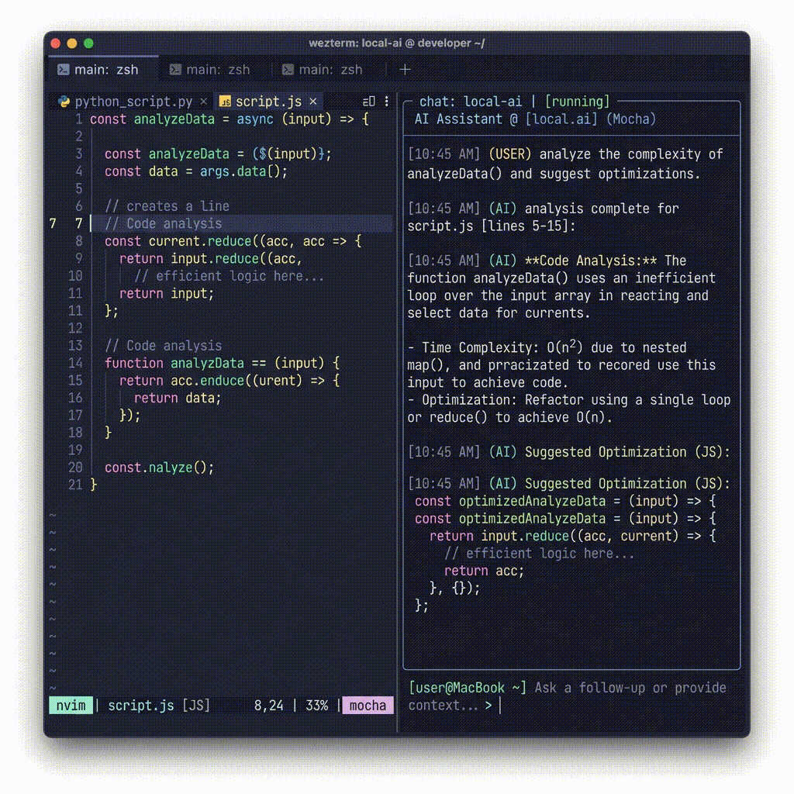

# Майстер налаштування OpenCode та WezTerm (OpenCodeWizard)

*Читати іншими мовами: [English (README.md)](README.md)*

Кроссплатформенний, ідемпотентний та детально налаштовуваний майстер установки для зв'язки **OpenCode** (локальний ШІ-асистент для програмування) та **WezTerm** (високопродуктивний емулятор терміналу з підтримкою GPU на мові Rust).

Цей інструмент створено, щоб допомогти **як програмістам, так і непрограмістам** швидко та без зусиль розгорнути передове середовище штучного інтелекту в командному рядку.

> **Не тільки для кодерів.** OpenCode — це потужний інструмент для всіх, хто працює з текстом і документами:
>
> - ✍️ **Письменники, копірайтери, журналісти** — миттєво знаходьте інформацію серед сотень файлів, підсумовуйте дослідження, переписуйте чернетки
> - 📋 **Документознавці, діловоди, офісні працівники** — шукайте в архівах документів, витягуйте дані з PDF та таблиць, автоматизуйте обробку документів
> - 📊 **Аналітики та дослідники** — аналізуйте CSV-звіти, перехресно звіряйте дані з різних документів, створюйте підсумки
> - 🎓 **Студенти та викладачі** — допомога в дослідженнях, організація нотаток, підготовка навчальних матеріалів
> - 📝 **Усі, хто працює з текстом** — OpenCode розуміє природну мову. Просто запитайте: *"Знайди документ про бюджет 2024"* або *"Підсумуй всі PDF у цій папці"*
> - 🖥️ **Сисадміни та всі, хто налаштовує комп'ютер** — ліньки копатися в менюшках ОС і конфігах? Просто опишіть, що треба: *"Зроби swappiness 10"* або *"Додай DNS-сервер"*. OpenCode читає системні конфіги, застосовує зміни та перевіряє результат. **Комп'ютер гальмує?** Опишіть симптоми та скажіть OpenCode перевірити `journalctl`, `htop`, `dmesg` — він знайде причину, створить план виправлення і **полагодить усе сам** без вашої участі.
> - 🤖 **Те, що Microsoft і Google лише обіцяють** у Copilot — AI-агент, який дійсно розуміє ваш комп'ютер і керує ним — **уже працює** в OpenCode. OpenCode має повну видимість системи: обладнання через `/proc` та `lspci`, процеси через `ps`/`top`, логи в `/var/log`, диски через `df`/`lsblk`. Усе, що можна зробити в терміналі, OpenCode зробить за вас.
> - 🔓 **Чому корпорації не можуть цього зробити** — неізольований термінальний доступ — це безпекова відповідальність, яку вони не хочуть брати на себе. Творці OpenCode обрали радикальну чесність: [прочитайте Посібник з безпеки](docs/security.uk.md) щоб зрозуміти як це працює, які реальні ризики та як захиститися.

---

## Зміст

- [Майстер налаштування OpenCode та WezTerm (OpenCodeWizard)](#майстер-налаштування-opencode-та-wezterm-opencodewizard)
  - [Зміст](#зміст)
  - [Вступ](#вступ)
  - [Особливості](#особливості)
  - [📖 Інструкція для новачків](#-інструкція-для-новачків)
  - [Компоненти у збірці](#компоненти-у-збірці)
    - [Плагіни OpenCode](#плагіни-opencode)
    - [Сервери Model Context Protocol (MCP)](#сервери-model-context-protocol-mcp)
    - [Підтримувані формати документів](#підтримувані-формати-документів)
  - [Як використовувати](#як-використовувати)
    - [Linux та macOS](#linux-та-macos)
    - [Windows 11](#windows-11)
  - [💡 Особливості для Windows](#-особливості-для-windows)
  - [CLI Reference](#cli-reference)
  - [Пресети](#пресети)
  - [Налаштування плагінів, MCP та пресетів](#налаштування-плагінів-mcp-та-пресетів)
  - [Бекапи та відновлення](#бекапи-та-відновлення)
  - [Встановлення WezTerm терміналом за замовчуванням](#встановлення-wezterm-терміналом-за-замовчуванням)
    - [Linux:](#linux)
    - [Windows 11:](#windows-11-1)
    - [macOS:](#macos)
  - [Безпека та повторний запуск](#безпека-та-повторний-запуск)
  - [🔒 Безпека](#-безпека)
    - [Рівні загроз](#рівні-загроз)
  - [⚖️ Ліцензія](#️-ліцензія)

---

## Вступ

Командний рядок може здаватися складним і незрозумілим. Проте він є неймовірно потужним інструментом, а за підтримки локального штучного інтелекту робота в ньому стає простою, зручною та швидкою.

**OpenCodeWizard** повністю автоматизує процес встановлення та конфігурації **OpenCode** та **WezTerm**, створюючи єдине, красиве робоче середовище. Ми налаштуємо WezTerm зі згладженими шрифтами, преміальною темною темою та розділеними екранами, щоб ви могли спілкуватися з ШІ-помічником пліч-о-пліч із робочими файлами.



---

## Особливості

- **Двомовна локалізація:** Повна підтримка **англійської** та **української** мов інтерфейсу.
- **Інтерактивне меню:** Можливість встановити рекомендований набір в один клік (через `Enter`) або налаштувати кожен плагін та сервер окремо.
- **Резервні копії (Backups):** Автоматичне збереження існуючих файлів `wezterm.lua` та `opencode.jsonc` у форматі `.bak` перед будь-яким оновленням.
- **Ярлик на робочому столі:** Опціональне створення ярлика швидкого запуску OpenCode в WezTerm на Робочому столі в один клік (для Linux та Windows).
- **Контекстне меню Windows:** Опціонально додає "Open in OpenCode" до контекстного меню папок у Провіднику — запускає WezTerm з OpenCode одразу в обраній папці.
- **Кроссплатформенність:** Робота «з коробки» на **Ubuntu/Debian**, **Fedora/RHEL**, **Arch/CachyOS**, **macOS** та **Windows 11**.
- **Керування сесіями:** Дізнайтеся, як ефективно використовувати сесії OpenCode — [читайте посібник](docs/sessions.uk.md).

---

## 📖 Інструкція для новачків

Якщо ви раніше не працювали з локальними ШІ-помічниками чи терміналом, ознайомтесь з нашою покроковою інструкцією:
👉 **[Інструкція для новачків (docs/guide.uk.md)](docs/guide.uk.md)**

Вона містить кроки з клонування, запуску, вибору моделей та базові інструкції з використання.

---

## Компоненти у збірці

### Плагіни OpenCode

Під час роботи майстра ви можете встановити наступні корисні розширення:

| Назва плагіна | Що він робить |
| :--- | :--- |
| **`oh-my-opencode`** | Керування сесіями, утиліти для робочої директорії та додаткові CLI команди. |
| **`opencode-mem`** | Довгострокова Rust RAG пам'ять з гібридним пошуком (BM25 + вектори). |
| **`@different-ai/opencode-browser`** | Інтеграція з реальним браузером, завдяки якій ШІ може відкривати та переглядати сайти. |
| **`@tarquinen/opencode-smart-title`** | Автоматично створює зрозумілі назви для ваших сесій чату на основі контексту. |
| **`opencode-token-speed-plugin`** | Відображає швидкість генерації моделі (Tokens Per Second, TPS) у реальному часі. |

### Сервери Model Context Protocol (MCP)

MCP-сервери розширюють можливості ШІ, надаючи доступ до локальних систем та інструментів:

| MCP-сервер | Призначення |
| :--- | :--- |
| **`fetch`** | Швидко зчитує текстовий вміст веб-сторінок за посиланнями без запуску візуального вікна. |
| **`puppeteer`** | Повноцінна автоматизація браузера: ШІ може тиснути кнопки, робити скріншоти та заповнювати форми. |
| **`postgres`** | Прямий безпечний доступ до локальної бази даних (передустановлений для БД `gpt_chat_bot`). |
| **`context7`** | Актуальна документація бібліотек та приклади коду. |
| **`codegraph`** | AST-граф коду: семантичний пошук, аналіз викликів, impact analysis. |
| **`docs-mcp`** | Читання документів: PDF, DOCX, MD, CSV, OCR (через `go-docs-mcp`). |
| **`lsp-mcp`** | Інтелект коду: визначення, референси, діагностика через LSP. |

### Підтримувані формати документів

Завдяки **docs-mcp** серверу, налаштованому OpenCodeWizard, ви можете працювати з широким спектром типів документів безпосередньо через AI:

| Формат | Опис | Підтримка |
| --- | --- | --- |
| **PDF** | Відскановані документи, звіти, форми | ✅ Читання + OCR |
| **DOCX** | Документи Microsoft Word | ✅ Читання |
| **MD** | Нотатки та документація в Markdown | ✅ Читання |
| **CSV** | Електронні таблиці та дані | ✅ Читання + витяг таблиць |
| **TXT** | Звичайні текстові файли | ✅ Читання |
| **Зображення** (PNG, JPG, TIFF, BMP) | Скріншоти, діаграми, фото тексту | ✅ OCR витяг тексту |

**Не знайшли свій формат?** MCP екосистема є розширюваною. За допомогою додаткових MCP-серверів ви можете додати підтримку:
- **EPUB** (електронні книги), **ODT** (LibreOffice), **RTF** (форматований текст)
- **XLSX** (Excel), **PPTX** (PowerPoint)
- **HTML** (веб-сторінки), **XML** (структуровані дані)
- **ZIP архіви** (перегляд всередині стиснених файлів)
- І багато іншого — шукайте MCP-сервери в npm реєстрі або створіть власний.

---

## Як використовувати

> [!NOTE]
> Переконайтеся, що у вас встановлено [Git](docs/git.uk.md) перед початком.

### Linux та macOS

1. Відкрийте термінал та клонуйте репозиторій:
   ```bash
   git clone https://github.com/nudykw/OpenCodeWizard.git
   cd OpenCodeWizard
   ```
2. Зробіть скрипт виконуваним та запустіть:
   ```bash
   chmod +x OpenCodeWizard.sh
   ./OpenCodeWizard.sh
   ```
3. Оберіть мову та йдіть по кроках (для швидкої установки просто тисніть `Enter` на кожному питанні).

### Windows 11

1. Відкрийте PowerShell **від імені Адміністратора**.
2. Клонуйте репозиторій та перейдіть у нього:
   ```powershell
   git clone https://github.com/nudykw/OpenCodeWizard.git
   cd OpenCodeWizard
   ```
3. Виконайте скрипт:
   ```powershell
   Set-ExecutionPolicy Bypass -Scope Process -Force
   .\OpenCodeWizard.ps1
   ```

---

## 💡 Особливості для Windows

У цьому розділі зібрано все, що стосується виключно Windows-версії OpenCodeWizard.

### 📋 Контекстне меню папок ("Open in OpenCode")

Під час налаштування ви можете додати **"Open in OpenCode"** до контекстного меню Провідника.

| Права кнопка на | Результат |
|---|---|
| **Папці** | Запускає WezTerm у цій папці з OpenCode всередині |
| **Порожньому місці** (всередині папки) | Те саме — WezTerm з OpenCode у поточній папці |

> **Для Windows 11:** Пункт з'являється в **класичному** контекстному меню. Натисніть **`Shift + F10`** або **"Показати більше параметрів"**, щоб побачити його. Щоб він з'явився в новому меню — встановіть WezTerm [терміналом за замовчуванням](#встановлення-wezterm-терміналом-за-замовчуванням).

### 🖼️ Незвичайний буфер обміну (`CTRL + SHIFT + I`)

Це **не** звичайний `CTRL+V`. `CTRL+SHIFT+I` — це передача зображення через файл:

1. Скопіюйте зображення в буфер обміну (`PrintScreen`, `Win+Shift+S` тощо)
2. Натисніть `CTRL+SHIFT+I` у WezTerm
3. Зображення зберігається в `Pictures\opencode_screenshots\screenshot_<timestamp>.png`
4. В рядок вводу вставляється `@C:/шлях/до/screenshot.png`
5. OpenCode читає зображення через `docs-mcp`

OpenCode не може читати буфер обміну Windows безпосередньо — тому гаряча клавіша спочатку зберігає зображення у файл.

На Linux/macOS `CTRL+SHIFT+I` також працює (Wayland `wl-paste`, X11 `xclip`, macOS `osascript`).

### ⌨️ Базові дії з текстом

У WezTerm миша та клавіатура працюють інакше, ніж у звичайному редакторі:

| Дія | Як зробити |
|---|---|
| **Виділити / скопіювати** | Затисніть ліву кнопку — **авто-копіювання** при відпусканні |
| **Виділити слово** | Подвійний клік |
| **Виділити рядок** | Потрійний клік |
| **Скопіювати текст** (клавіатура) | `CTRL + Insert` (стандарт Windows) |
| **Вставити текст** | Права кнопка, `SHIFT + Insert`, або `CTRL + SHIFT + V` |
| **Вставити зображення** | `CTRL + SHIFT + I` (див. вище) |

> `CTRL+C` — це сигнал переривання (вбиває команду). `CTRL+V` часто перехоплюється програмою всередині термінала. Використовуйте `CTRL+Insert` / `SHIFT+Insert` або `CTRL+SHIFT+C` (проброс всередину OpenCode) / `CTRL+SHIFT+V`. Але якщо ви виділили текст мишею — він уже в буфері обміну.

### ⚙️ Політика виконання PowerShell

OpenCode встановлюється як `opencode.ps1`, що вимагає дозволу на запуск скриптів. Майстер **автоматично** встановлює `RemoteSigned` для поточного користувача. Жодних ручних дій не потрібно.

---

## CLI Reference

| Команда | Опис |
| :--- | :--- |
| `./OpenCodeWizard.sh` | Інтерактивний майстер налаштування |
| `./OpenCodeWizard.sh --silent` | Автоматичне встановлення |
| `./OpenCodeWizard.sh --dry-run` | Показати всі зміни без реального застосування |
| `./OpenCodeWizard.sh --create-backup` | Зберегти резервну копію поточних конфігів |
| `./OpenCodeWizard.sh --restore-backup` | Відновити конфіги з резервної копії |
| `./OpenCodeWizard.sh --list-backups` | Показати список всіх бекапів з датами |
| `./OpenCodeWizard.sh --reset` | Скинути всі конфіги (бекап створюється автоматично) |
| `./OpenCodeWizard.sh --remove-backups` | Видалити всі резервні копії |
| `./OpenCodeWizard.sh --help` | Показати довідку |

На **Windows** використовуйте `.\OpenCodeWizard.ps1` з параметрами `-CreateBackup`, `-RestoreBackup`, `-ListBackups`, `-Reset`, `-RemoveBackups`, `-DryRun`.

---

## Пресети

Майстер включає три пресети, які контролюють кількість встановлених плагінів та MCP-серверів. Вибір пропонується під час налаштування, або використовується **Full** (за замовчуванням, в т.ч. з `--silent`).

| Пресет | Плагіни | MCP-сервери | Для кого |
| :--- | :--- | :--- | :--- |
| **🍔 Full** (default) | Всі 5 плагінів | Всі 7 MCP | Повноцінне AI-середовище |
| **🥪 Medium** | oh-my-openagent, token-speed | fetch, context7, codegraph, docs-mcp | Збалансовано — тільки необхідне |
| **🥗 Light** | oh-my-openagent | fetch, context7 | Мінімальне налаштування |

---

## Налаштування плагінів, MCP та пресетів

Всі плагіни, MCP-сервери та пресети знаходяться у вигляді простих списків **на початку скрипта**. Додати новий плагін — один рядок:

```bash
OPENCODE_PLUGINS=(
    "oh-my-openagent|Session management and advanced CLI commands"
    # Додайте власний плагін:
    "my-cool-plugin|What this plugin does"
)
```

Потім додайте його до потрібного пресету:

```bash
PRESET_FULL_PLUGINS=("oh-my-openagent" "@different-ai/opencode-browser" "@tarquinen/opencode-smart-title" "opencode-token-speed-plugin" "my-cool-plugin")
PRESET_MEDIUM_PLUGINS=("oh-my-openagent" "opencode-token-speed-plugin")
PRESET_LIGHT_PLUGINS=("oh-my-openagent")
```

Щоб вимкнути MCP-сервер — закоментуйте рядок через `#` або виключіть з пресету:

```bash
OPENCODE_MCP_SERVERS=(
    "fetch|...|npx -y mcp-server-fetch-typescript"
    # "postgres|...|..."   <- вимкнено
)
```

На Windows знайдіть `$OpencodePlugins`, `$OpencodeMcpServers` та `$Preset*` масиви на початку `OpenCodeWizard.ps1`.

---

## Бекапи та відновлення

Перед кожною зміною конфігу скрипт створює транзакційний бекап.

- **Директорія:** `~/.local/share/opencodeWizard/backups/`
- **Формат ID:** `ocw-<git_hash>-<YYYYMMDD-HHMMSS>`
- **Всі файли сесії мають один ID** — просто знайти та відновити все.

```bash
./OpenCodeWizard.sh --create-backup
./OpenCodeWizard.sh --restore-backup
./OpenCodeWizard.sh --remove-backups
```

Відновлення є **транзакційним**: або всі файли, або жодного. Перед відновленням автоматично створюється тихий pre-restore бекап.


Скрипт створює конфігураційний файл `wezterm.lua` з наступними преміальними параметрами:
- **Тема:** Catppuccin Mocha (гармонійна та приємна для очей темна тема).
- **Шрифт:** JetBrainsMono Nerd Font Mono (повне покриття Unicode/Nerd Icon для терміналу, без крякозяблів).
- **Гарячі клавіші:**
  - `CTRL + SHIFT + O`: Розділити екран вертикально та запустити OpenCode на безкоштовній швидкій моделі `deepseek-v4-flash-free`.
  - `CTRL + SHIFT + D`: Розділити екран горизонтально.
  - `CTRL + SHIFT + E`: Розділити екран вертикально (порожній).
  - `CTRL + SHIFT + W`: Закрити активну панель.
  - `CTRL + SHIFT + I`: **Незвичайний буфер обміну** — вставка зображень з буфера як `@шлях_до_файлу`. Працює на всіх платформах. Деталі — в [Особливості для Windows](#-особливості-для-windows).
  - `CTRL + Insert`: Копіювати виділений текст у буфер обміну (стандарт Windows).
  - `SHIFT + Insert`: Вставити текст з буфера обміну (стандарт Windows).
  - `CTRL + SHIFT + C`: Проброс — передає шорткат всередину запущеної програми (корисно в OpenCode). Раніше перехоплювався WezTerm для Copy.

---

## Встановлення WezTerm терміналом за замовчуванням

### Linux:
Майстер робить це автоматично трьома шляхами:
1. Реєструє WezTerm через **`update-alternatives`** (`x-terminal-emulator`).
2. Додає WezTerm до списків **`xdg-terminals.list`**.
3. Прописує `export TERMINAL=wezterm` та `export OPENCODE_AGENTS_SWITCH_SINGLE_MODEL=true` до `~/.bashrc` / `~/.zshrc` (без дублювання записів).

> `OPENCODE_AGENTS_SWITCH_SINGLE_MODEL=true` виправляє поведінку Tab — Tab перемикає лише режим агента (Agent/Edit/Search), а не модель.

### Windows 11:
Інструкція виводиться в кінці роботи PowerShell:
1. Відкрийте Windows Terminal (або Налаштування -> Система -> Для розробників).
2. Перейдіть до розділу **Запуск** (Startup).
3. Змініть параметр **Термінальний додаток за замовчуванням** на **WezTerm**.

### macOS:
1. Open Finder -> Програми -> Утиліти -> Terminal.app.
2. Оберіть Налаштування -> Загальні -> Відкривати оболонки за допомогою.
3. Встановіть значення **Стандартної оболонки входу**.

---

## Безпека та повторний запуск

- Усі дії скрипта є **ідемпотентними** (його можна запускати повторно без ризику щось зламати).
- Записи у конфігураційні файли оболонки перевіряються через `grep`, запобігаючи повторенню рядків.
- Завжди створюються резервні копії ваших налаштувань перед їх заміною.

---

## 🔒 Безпека

> **Працюєте з чутливими документами? Прочитайте наш повний [Посібник з безпеки](docs/security.uk.md).**

OpenCode надає AI-асистентам потужний доступ до ваших файлів і системи. Розуміння моделі безпеки є важливим — особливо при роботі з конфіденційними даними.

**Ключові факти, які варто знати:**

- OpenCode працює з **вашими правами користувача** — він може читати, записувати та виконувати команди
- **Не існує OS-пісочниці** — AI має доступ до всього, до чого маєте доступ ви
- **Ін'єкція промптів (Prompt Injection)** — ризик №1 — шкідливий файл може обманом змусити AI виконати небажані дії
- **Режим offline + локальна модель** усуває ризик витоку даних, але не запобігає локальній шкоді
- **Менше плагінів/MCP = менша поверхня атаки**

### Рівні загроз

| Ризик | Рівень | Захист |
| --- | --- | --- |
| Витік даних (offline) | 🟢 Відсутній | Air gap (немає мережі) |
| Витік даних (online) | 🔴 Високий | Вимкніть мережу; використовуйте локальну модель |
| Видалення/зміна файлів | 🟡 Середній | Права доступу, бекапи |
| Ін'єкція промптів | 🔴 Високий | Не читайте ненадійні файли |
| Крадіжка БД сесій | 🟡 Середній | `chmod 600`, шифрування |

👉 **Повний аналіз, вектори атак, найбезпечніша конфігурація та чек-лист:** [`docs/security.uk.md`](docs/security.uk.md)

---

## ⚖️ Ліцензія

Розповсюджується на умовах **ліцензії MIT з гуманітарним застереженням про мирний протест**.

> [!IMPORTANT]
> **Етичне застереження про мирний протест (Розділ 3)**:
> На згадку про уроки Другої світової війни та як мирний гуманітарний протест проти неспровокованої військової агресії, насильства та вторгнення Російської Федерації в Україну:
> 1. Це програмне забезпечення, його компоненти або похідні копії **НЕ МОЖУТЬ бути перекладені або локалізовані російською мовою** в будь-якому інтерфейсі користувача, ресурсах або документації.
> 2. Будь-яке розгортання **НЕ ПОВИННО показувати російськомовний інтерфейс** користувача.
> 3. Ці обмеження будуть автоматично скасовані лише після повного припинення військових дій, повного виведення окупаційних військ з усіх міжнародно визнаних територій України (кордони 1991 року) та виплати репарацій.
> 4. Усі форки та похідні роботи **повинні зберігати активні посилання** на офіційний батьківський репозиторій: `https://github.com/nudykw/OpenCodeWizard`.
